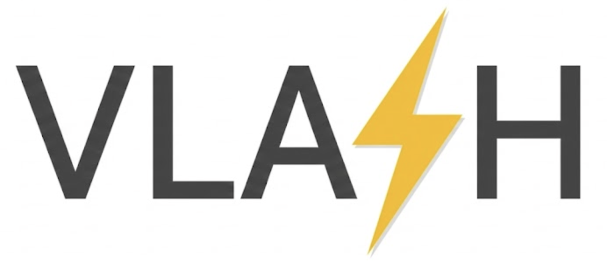
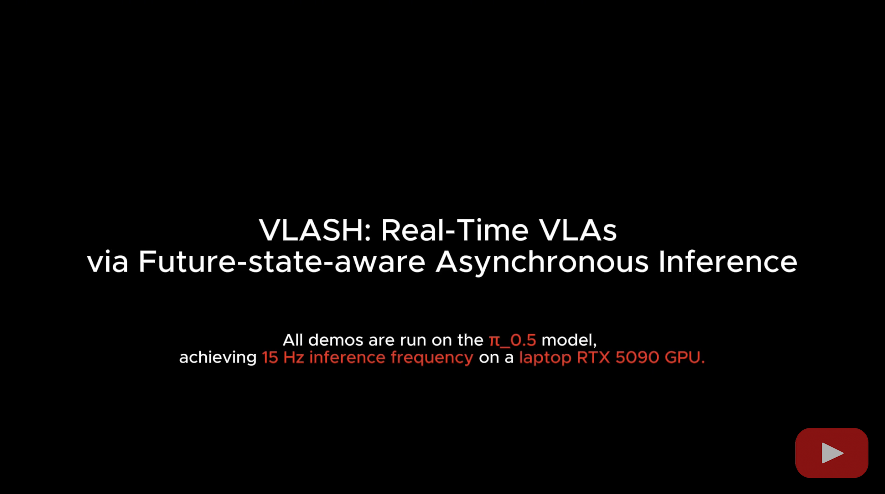

<!-- markdownlint-disable MD001 MD041 -->

<p align="center">
  <picture>
    
  </picture>
</p>
<h3 align="center">
Easy-to-use VLA deployment, fast to react, smooth in motion.
</h3>

<p align="center">
    <a href="https://arxiv.org/abs/2512.01031"><b>Paper</b></a>
    &nbsp;|&nbsp;
    <a href="https://youtu.be/PLACEHOLDER"><b>Demo Video</b></a>
</p>

---

## Group Members

| Name | Student ID | Email | Contribution |
|------|-----------|-------|--------------|
| TBD  | TBD       | TBD   | TBD          |

---

## About

VLASH is an efficient and easy-to-use framework for VLAs fine-tuning and inference.

VLASH is efficient through:

- Asynchronous inference for **fast reaction and smooth motion** in real-time (**>30Hz inference frequency** for $\pi_{0.5}$ on RTX 5090)
- Future-state-awareness to enable **stable asynchronous VLA inference without overhead**
- Action quantization for **faster robot execution speed**
- LoRA with shared observation encoding for **efficient fine-tuning on consumer GPUs**

VLASH is easy to use with:

- **Seamless integration with [LeRobot](https://github.com/huggingface/lerobot)** datasets (v2.1, v3.0), models and robots
- Simple YAML-based configuration system
- Support for various policy architectures (e.g., $\pi_{0.5}$, $\pi_0$, ...)
- Easy deployment on real robot hardware
- **Docker and Singularity containers** for reproducible cloud and HPC deployment

## Demo

[](https://www.youtube.com/watch?v=IgN7CNicJS8)

---

## Getting Started

### Option A — Docker (recommended for cloud)

**Prerequisites:** Docker with [NVIDIA Container Runtime](https://docs.nvidia.com/datacenter/cloud-native/container-toolkit/install-guide.html) installed. The image is based on `nvcr.io/nvidia/cuda:12.6.3-devel-ubuntu24.04` — Docker will pull it automatically on first build (~5 GB base layer, cached afterwards).

```bash
# 1. Build the image (no GPU needed for build)
docker build -t vlash:latest .

# 2. Verify GPU access inside the container
docker run --rm --gpus all vlash:latest \
  pixi run python -c "import torch; print(torch.cuda.is_available())"

# 3. Run training (set your HuggingFace token and dataset)
docker run --rm --gpus all \
  -e HF_TOKEN=<your_hf_token> \
  -e DATASET_REPO_ID=<your-org/your-dataset> \
  -v $(pwd)/outputs:/workspace/outputs \
  -v $(pwd)/hf_cache:/hf_cache \
  -e HF_HOME=/hf_cache \
  vlash:latest examples/train/pi05/cloud.yaml
```

> **First-run note:** DeepSpeed and bitsandbytes compile CUDA extensions on the first training run. This takes ~1–3 minutes and is a one-time overhead — not a crash.

### Option B — Docker Compose (single-node multi-GPU)

```bash
# Copy and fill in environment variables
cp .env.example .env   # or export them directly

export HF_TOKEN=<your_hf_token>
export NUM_GPUS=4

docker-compose up
```

### Option C — Singularity / HPC (NSCC ASPIRE or any SLURM cluster)

```bash
# Build the Singularity image from the Docker image
singularity build vlash.sif singularity.def

# Run on NSCC ASPIRE (PBS scheduler)
singularity run --nv \
  -B /scratch/users/ntu/m230060:/scratch \
  vlash.sif examples/train/pi05/cloud.yaml
```

The entrypoint automatically normalises `CUDA_VISIBLE_DEVICES` from PBSpro UUID format to integer indices — no manual export needed in your PBS job script.

### Option D — Kubernetes

See [k8s/training-job.yaml](k8s/training-job.yaml) for a complete Kubernetes Job manifest with GPU resource requests and persistent volume claims for model cache and outputs.

```bash
kubectl create secret generic hf-secret --from-literal=token=<YOUR_HF_TOKEN>
kubectl apply -f k8s/training-job.yaml
kubectl logs -f job/vlash-train
```

---

## Dataset Preparation

VLASH loads datasets from HuggingFace Hub at training time. Your dataset must be in [LeRobot format](https://github.com/huggingface/lerobot) (the `data/`, `videos/`, `meta/` folder structure with a `meta/info.json`).

### Upload a local dataset to HuggingFace

```bash
# Login once
huggingface-cli login

# Create the dataset repo (once)
huggingface-cli repo create your-dataset-name --type dataset --private

# Upload the folder (preserves directory structure exactly)
huggingface-cli upload your-hf-username/your-dataset-name \
  /path/to/local/lerobot/dataset/ \
  --repo-type dataset
```

Then set `DATASET_REPO_ID=your-hf-username/your-dataset-name` in your `docker run` command — the container downloads it automatically at training start via `HF_TOKEN`.

### Team / shared datasets

For shared write access, create a [HuggingFace organization](https://huggingface.co/organizations/new) and push under the org:

```bash
huggingface-cli upload your-org-name/your-dataset-name \
  /path/to/local/lerobot/dataset/ \
  --repo-type dataset
```

Invite collaborators at `huggingface.co/your-org-name` → Settings → Members. Set `DATASET_REPO_ID=your-org-name/your-dataset-name` in your training command.

---

## Multi-GPU Training

VLASH uses [HuggingFace Accelerate](https://huggingface.co/docs/accelerate) with DeepSpeed ZeRO-2 for distributed training. The `deepspeed_config.yaml` at the repo root configures ZeRO-2 (optimizer state + gradient sharding), bf16 mixed precision, and gradient clipping.

The number of GPUs is controlled by the `NUM_GPUS` environment variable (default: 1). When using Docker Compose, set `NUM_GPUS=4` in your environment.

**ZeRO-2 vs DDP:** ZeRO-2 shards optimizer states and gradients across GPUs, roughly halving per-GPU memory vs vanilla DDP for the same batch size. For pi0.5 (~3B parameters) on 4×A100 this enables `batch_size=1` with `grad_accum_steps=8` without CPU offloading.

---

## Local Installation (without Docker)

```bash
# Install pixi
curl -fsSL https://pixi.sh/install.sh | bash

# Install the pinned environment
pixi install

# Verify
pixi run python -c "import vlash; print('OK')"
```

### Quick Examples

**Fine-tune a VLA policy for your task:**

```bash
vlash train examples/train/pi05/async_lora.yaml
```

**Distributed training on 4 GPUs:**

```bash
accelerate launch \
  --config_file deepspeed_config.yaml \
  --num_processes 4 \
  -m vlash.train examples/train/pi05/cloud.yaml
```

**Run async inference on a robot:**

```bash
vlash run examples/inference/async.yaml
```

**Run async inference with 2x speedup:**
```bash
vlash run examples/inference/async.yaml --action_quant_ratio=2
```

---

## TODO
- [x] LoRA fine-tuning for $\pi_{0.5}$, $\pi_0$ under 12G GPU memory
- [ ] QLoRA fine-tuning for $\pi_{0.5}$, $\pi_0$ under 8G GPU memory
- [x] Efficient fine-tuning with shared observation
- [x] DeepSpeed ZeRO-2 distributed training
- [x] Docker and Singularity containers for cloud/HPC deployment

## Acknowledgment

This project is built upon the following excellent open-source projects: [LeRobot](https://github.com/huggingface/lerobot), [PEFT](https://github.com/huggingface/peft), [DeepSpeed](https://github.com/microsoft/DeepSpeed), [pixi](https://pixi.sh).

## License

Apache 2.0
